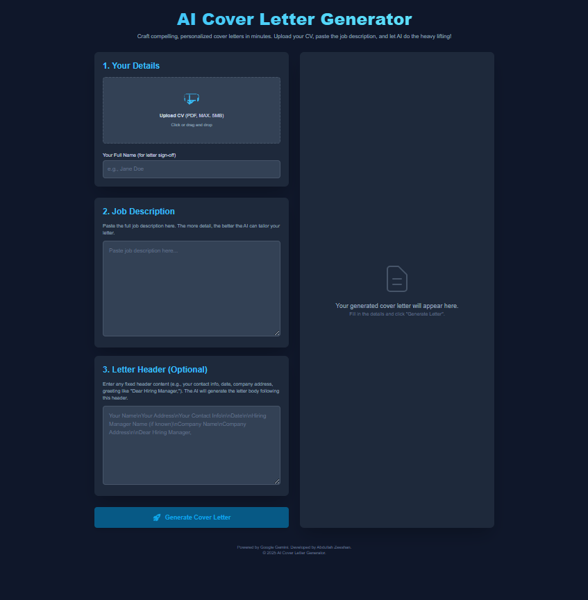

# Run and Deploy Your AI Studio App

This repository contains everything you need to run your app locally.

## Prerequisites

- [Node.js](https://nodejs.org/) installed on your machine

## Getting a Google Gemini API Key

To run the app locally, you need an API key from **Google Gemini**:

1. Go to the [Google Cloud Console](https://console.cloud.google.com/).
2. Create or select a project.
3. Enable the **Generative Language API**.
4. Create credentials (an API key) for this service.
5. Copy your API key.

## Setup and Run Locally

1. Clone the repository and navigate to the project folder.
2. Install dependencies:
   ```bash
   npm install
3. Create a .env.local file in the root of the project (if it doesn’t exist).
4. Add your Google Gemini API key to .env.local like this:
   ```ini
   GEMINI_API_KEY=your-google-gemini-api-key-here
5. Start the development server:
   ```bash
   npm run dev
6. Open the URL shown in your terminal (usually http://localhost:3000) in your browser.


